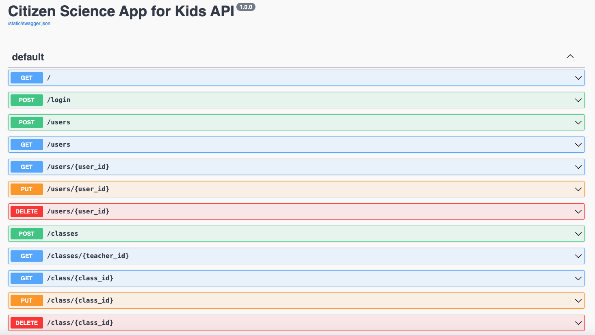

# CS467-CitizenScienceApp
To run the server on http://127.0.0.1:5000
- Navigate to project directory
- Create/activate virtual environment

    ```bash
    python -m venv venv
    ```

    - On Mac: 

    ```bash
    source venv/bin/activate
    ```  

    - On Windows: 

    ```bash
    venv\Scripts\activate
    ```

- Install dependencies
    - For Python3: 
    
    ```bash    
    pip3 install -r requirements.txt
    ```
  
- Create database and tables for testing - only needed the first time
  ```bash
    # Connect to MySQL and enter/copy-paste password when prompted: OSUcapstone
      mysql -u capstone -p
  
    # At MySQL interface: 
      # Create the database
      CREATE DATABASE citizen_science_app;  
      # Verify the database is created
      SHOW DATABASES; 
      EXIT; 
  
    # Perform a database migration afresh to create tables: 
    # The following 3 commands will generate a new migration python file in backend/migrations/versions
    # Do not push/merge any testing migration python file to prevent errors 
    # Reference: https://stackoverflow.com/questions/17768940/target-database-is-not-up-to-date
      flask --app main db stamp head 
      flask --app main db migrate -m "Fresh migration"
      flask --app main db upgrade
    ```

- Run Flask server
    ```bash
    flask --app main run
    ```


# To interact with REST API:
- Create/activate a virtual environment (see commands above)
- Install flask_swagger_ui package - skip this step if all dependencies are installed
    ```bash
    pip3 install flask_swagger_ui
    ```
- Start Flask server 
    ```bash
    flask --app main run
    ```
  
- Open http://127.0.0.1:5000/swagger:

- Click open an API endpoint, customize parameters to try it out  
  - To request data, send a http request to `http://127.0.0.1:5000`. For example,
    - If `curl` is installed, you can use `curl` command to send a post request to add a new observation (customize parameters for your application):
      ```bash
      curl -X 'POST' \
        'http://127.0.0.1:5000/observations' \
        -H 'accept: application/json' \
        -H 'Content-Type: application/json' \
        -d '{
        "project_id": 5,
        "anon_user_id": 2,
        "data": {"test":"test"}
      }'
      ```
    - To use the same example request via React Native fetch:
      ```js
      fetch('http://127.0.0.1:5000/observations', {
        method: 'POST',
        headers: {
          'accept': 'application/json',
          'Content-Type': 'application/json'
        },
        body: JSON.stringify({
          project_id: 5,
          anon_user_id: 2,
          data: {"test":"test"}
        })
      })
      ```
-  [Summary of API endpoints](backend/static/API_documentation.md)


# CS_Field_App Development Instructions

## Prerequisites

Before you begin, make sure you have the following installed:

-   **Node.js:** Ensure you have Node.js installed on your system. You can download it from [nodejs.org](https://nodejs.org/). It's recommended to use the latest LTS version.
-   **npm or Yarn:** Node.js comes with npm (Node Package Manager). Alternatively, you can use Yarn.
-   **Expo CLI:** Install the Expo CLI globally to manage your Expo projects.

    ```bash
    npm install -g expo-cli
    ```

    or

    ```bash
    yarn global add expo-cli
    ```

-   **Git:** You'll need Git for version control.  Install it from [git-scm.com](https://git-scm.com).
-   **Expo Go (Optional):**  For testing on a physical device, download the Expo Go app on your iOS or Android device.
    -   [Expo Go on the App Store](https://apps.apple.com/app/expo-go/id982107779)
    -   [Expo Go on the Google Play Store](https://play.google.com/store/apps/details?id=host.exp.exponent&hl=en_US)
-   **Android Studio/Xcode (Optional):** If you plan to build native Android or iOS apps, you'll need to install Android Studio (for Android) or Xcode (for iOS).

## Getting Started

1.  **Clone the repository:**

    ```bash
    git clone <repository-url>
    cd CS_Field_App
    ```

2.  **Install dependencies:**

    ```bash
    npm install
    ```

    or

    ```bash
    yarn install
    ```

3.  **Start the development server:**

    ```bash
    npm start
    ```

    or

    ```bash
    yarn start
    ```

    This will start the Expo development server. You can then:

    -   Scan the QR code with the Expo Go app (on a physical device).
    -   Run on an Android emulator or iOS simulator.
    -   Open in your web browser.

## Useful Commands

-   `npm start` or `yarn start`: Starts the Expo development server.
-   `npm run android` or `yarn android`: Runs the app on an Android emulator/device.
-   `npm run ios` or `yarn ios`: Runs the app on an iOS simulator/device.
-   `npm run web` or `yarn web`: Runs the app in the web browser.
-   `npm run lint` or `yarn lint`: Runs the linter to check for code quality.
-   `npm test` or `yarn test`: Runs the test suite.
-   `npm run reset-project`: Resets the project by moving directories and creating new app directories.

## Directory Structure

-   `app/`: Contains the main application code, including screens and components.
-   `assets/`: Contains images, icons, and other static assets.
-   `components/`: Reusable React Native components.
-   `constants/`:  Constants used throughout the application.
-   `hooks/`: Custom React hooks.
-   `scripts/`:  Scripts for project setup and maintenance.

## Resetting the Project

The project includes a script to reset the project structure:

```bash
npm run reset-project
